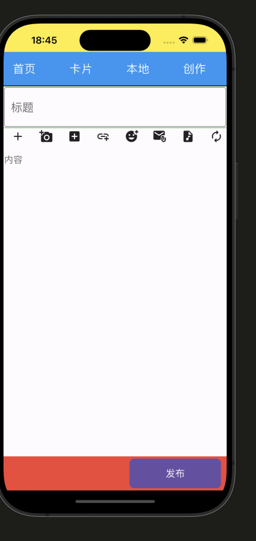
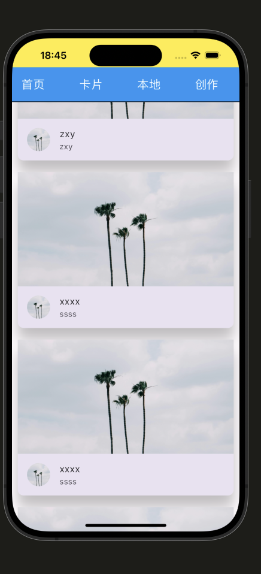

# flutter-demo

本项目是学习flutter时用来练手创建的项目，正在一天天完成这个APP；主要是用来熟悉和使用flutter；忘大家一起监督学习。

## 卡片及创作页面的设计
使用到的包，mysql暂时还为写完，只是完成了基本的连接
```
dependencies:
  flutter:
    sdk: flutter
  cupertino_icons: ^1.0.6
  go_router: ^12.0.0
  mysql1: ^0.20.0
```
首先设计了一个创作页面


然后还有一个卡片的页面


其中“首页”，“卡片”，“本地”，“创作”的跳转实现，下一步设计每个页面的详细内容，数据库打算用mysql实现，但是需要注意，官方给定的mysql支持的mysql服务器版本较低，不能使用太高的，否则会造成数据的无法添加。