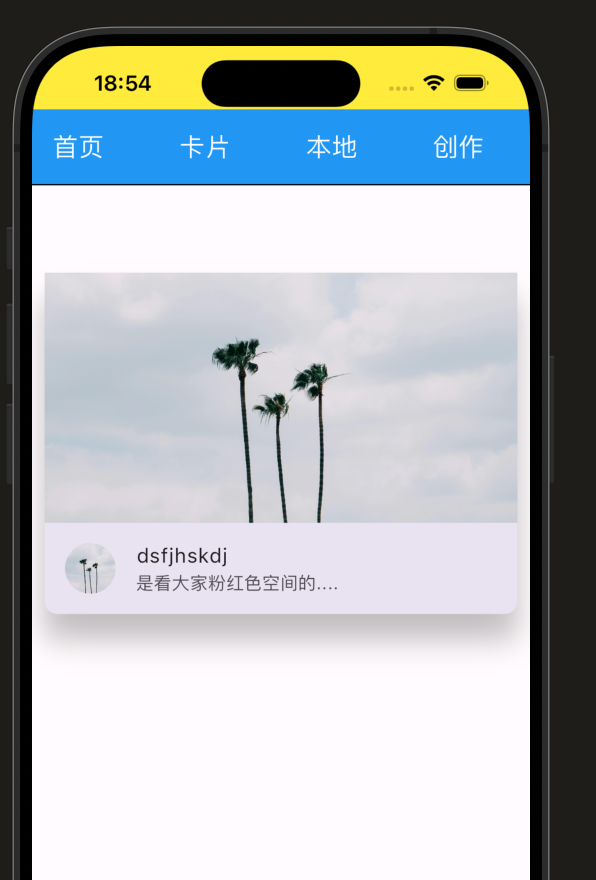
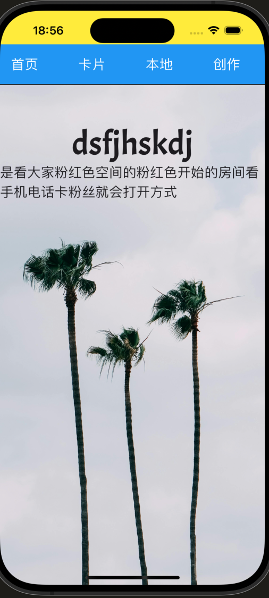

# flutter-demo

本项目是学习flutter时用来练手创建的项目，正在一天天完成这个APP；主要是用来熟悉和使用flutter；忘大家一起监督学习。

## 卡片及创作页面的设计
使用到的包
```
dependencies:
  flutter:
    sdk: flutter
  cupertino_icons: ^1.0.6
  go_router: ^12.0.0
  hive: ^2.2.3
  hive_flutter: ^1.1.0
  google_fonts: ^6.2.1
```
首先设计了一个创作页面


然后还有一个卡片的页面


其中“首页”，“卡片”，“本地”，“创作”的跳转实现，下一步设计每个页面的详细内容，数据库打算用hive实现，但是需要注意。

## 第二天
完成本地页面的设计并且使用hive完成了文章的创作和查询；其中长按图片中的标签可对其进行删除。


其中创作页面可以实现创作点击发布可实现跳转至本地显示文章详情。


## 第三天
今天完成卡片页面的显示以及详细页面的显示，可以通过点击卡片显示详细页面





同时在详情页面使用了google的插件来显示个性字体





至此本项目基本完成，还有部分功能尚未实现，在后面继续学习的路上会不断进行更新。